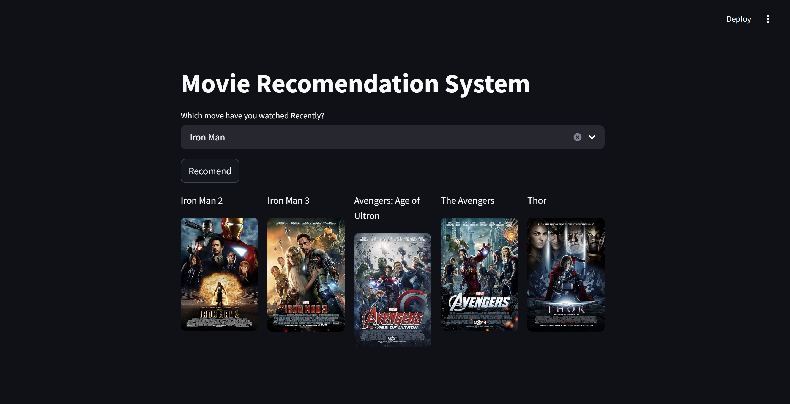

# 🎬 Movie Recommendation System

This is an end-to-end **Movie Recommendation System** web app. When a user selects a movie they like, the app predicts and recommends similar movies based on **content-based filtering** using **cosine similarity**.

📺 **Live Demo**: [Check it out here!](https://movie-recommendation-system-rahul5r.streamlit.app/)

---

## 📌 Features

- Recommend movies similar to the one you like
- Clean and interactive web interface built with Streamlit
- Uses **content-based filtering** with **cosine similarity**
- Built on the **TMDB 5000 Movies Dataset**

---

## 🧠 How it Works

- The system uses metadata (like genre, cast, director, etc.) from each movie to create a **feature vector**.
- It then calculates the **cosine similarity** between the selected movie and others in the dataset.
- The top similar movies are returned as recommendations.

---

## 🛠️ Tech Stack

- **Python**
- **Pandas / NumPy / Scikit-learn**
- **Streamlit** (for the web app interface)
- **TMDB 5000 Movies Dataset**

---

## 🚀 Getting Started

### 1. Clone the repository

```bash
git clone https://github.com/rahul5r/Movie-Recommendation-System/
cd Movie-Recommendation-System
```

### 2. Install dependencies

```bash
pip install -r requirements.txt
```

### 3. Run the app locally

```bash
streamlit run app.py
```

---

## 📂 Dataset

- TMDB 5000 Movies Dataset: [Kaggle Link](https://www.kaggle.com/datasets/tmdb/tmdb-movie-metadata)

---

## 📸 Screenshot





## 🙌 Acknowledgements

- [The Movie Database (TMDB)](https://www.themoviedb.org/)
- [Kaggle for the dataset](https://www.kaggle.com/datasets/tmdb/tmdb-movie-metadata)

---
